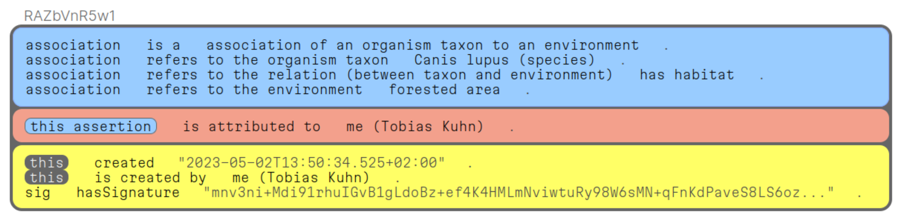
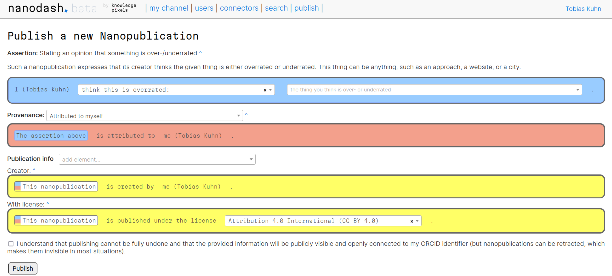
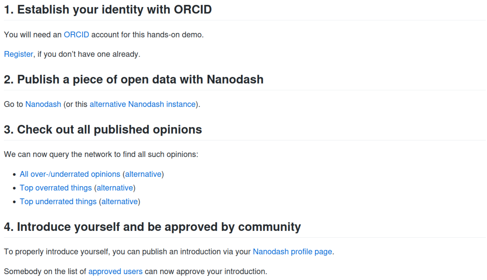
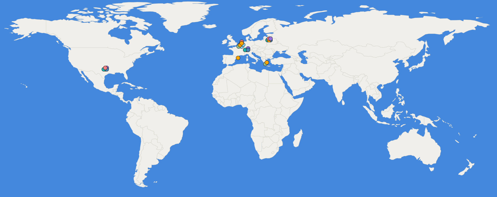
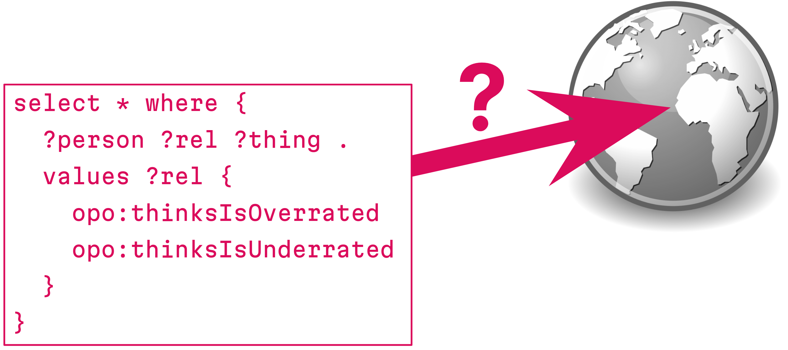

## FAIR Knowledge with Nanopublications

_Tobias Kuhn_

Data Quality Workshop

<small>Switch, Zurich, 4 July 2023</small>

---

## FAIR is about datasets

_(or is it?)_

---

## FAIR

_FAIR Guiding Principles:_ Scientific datasets should be ...

- Findable
- Accessible
- Interoperable
- Reusable

  

<small>Mark Wilkinson _et al._ The FAIR Guiding Principles for scientific data management and stewardship. Scientific Data, 3(160018), 2016.</small>

---

<section>
<h3>Findable</h3>
<ul>
<li>F1. (meta)data are assigned a globally unique and persistent identifier</li>
<li>F2. data are described with rich metadata (defined by R1 below)</li>
<li>F3. metadata clearly and explicitly include the identifier of the data it describes</li>
<li>F4. (meta)data are registered or indexed in a searchable resource</li>
</ul>
</section>

---

## Identifiers!

 

Let me identify myself:

<a href="https://orcid.org/0000-0002-1267-0234">https://orcid.org/0000-0002-1267-0234</a>

---

<section>
<h3>Accessible</h3>
<ul>
<li>A1. (meta)data are retrievable by their identifier using a standardized communications protocol</li>
<li>A1.1. the protocol is open, free, and universally implementable</li>
<li>A1.2. the protocol allows for an authentication and authorization procedure, where necessary</li>
<li>A2. metadata are accessible, even when the data are no longer available</li>
</ul>
</section>

---

<section>
<h3>Interoperable</h3>
<ul>
<li>I1. (meta)data use a formal, accessible, shared, and broadly applicable language for knowledge representation</li>
<li>I2. (meta)data use vocabularies that follow FAIR principles</li>
<li>I3. (meta)data include qualified references to other (meta)data</li>
</ul>
</section>

---

## FAIR is about knowledge!

_(not just datasets)_

---

<section>
<h3>Reusable</h3>
<ul>
<li>R1. (meta)data are richly described with a plurality of accurate and relevant attributes</li>
<li>R1.1. (meta)data are released with a clear and accessible data usage license</li>
<li>R1.2. (meta)data are associated with detailed provenance</li>
<li>R1.3. (meta)data meet domain-relevant community standards</li>
</ul>

---

## Everybody wants/needs to be FAIR ...

... but nobody knows how to do it.

_(yet)_

---

## Nanopublications

Tiny containers of FAIR knowledge for scientific publishing:

<a href="https://nanopub.net">nanopub.net</a>

---

## Hands-on Demo:

<small><a href="https://knowledgepixels.com/switch-demo" target="_blank">knowledgepixels.com/switch-demo</a></small>

---

## Cutting Edge Warning

<small><a href="https://knowledgepixels.com/switch-demo" target="_blank">knowledgepixels.com/switch-demo</a></small>

---

## Overrated/Underrated

<small><a href="https://knowledgepixels.com/switch-demo" target="_blank">knowledgepixels.com/switch-demo</a></small>

---

## Links and Instructions

Visit <a href="https://knowledgepixels.com/switch-demo" target="_blank">knowledgepixels.com/switch-demo</a>

---

## Decentralized Ecosystem

<small><a href="https://knowledgepixels.com/switch-demo" target="_blank">knowledgepixels.com/switch-demo</a></small>

---

## Querying the Network

<small><a href="https://knowledgepixels.com/switch-demo" target="_blank">knowledgepixels.com/switch-demo</a></small>

---

## Nanopublications are (quite) FAIR

- _F:_ Identifiers and searchable
- _A:_ Retrievable through the decentralized network
- _I:_ Machine-interpretable due to use of RDF
- _R:_ Rich metadata: provenance, license, etc.

<small><a href="https://knowledgepixels.com/switch-demo" target="_blank">knowledgepixels.com/switch-demo</a></small>

---

## Thank you for your attention!

  

_Questions?_

