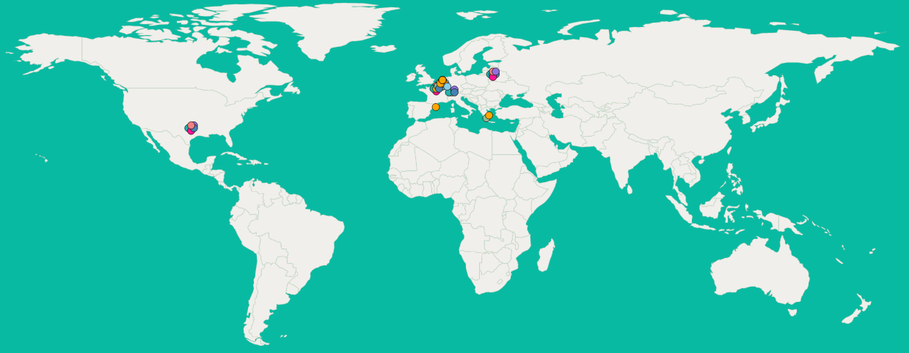

## Nanopublications for FDOs

_Tobias Kuhn_

FDO4DE Pilot Workshop, 28 February 2024, Bremen

[https://knowledgepixels.com/slides/fdo4de-pilot-workshop/](https://knowledgepixels.com/slides/fdo4de-pilot-workshop/)

---

<svg xmlns="http://www.w3.org/2000/svg" viewBox="0 0 8 8" width="80px">
<path d="M5,8H8L3,0H0M8,4.8V0H5M0,3.2V8H3"/>
</svg>

## What are Nanopublications?

- _Tiny packages of knowledge graph (RDF) contributions_
- Come with provenance and metadata
- Treated as individual independent publications
- Reliably referenced with hash-based identifiers
- Can be digitally signed

**Example:**

<small>[https://w3id.org/np/RAbNN09tl3ROzrXxOqYrtIcquEqcXWGvOki_2YPGc89xo](https://w3id.org/np/RAbNN09tl3ROzrXxOqYrtIcquEqcXWGvOki_2YPGc89xo)</small>

---

## Nanopublications: Updates and Collections

- Nanopublications are _immutable_ by definition
- To _update_ a nanopublication, a new nanopublication can declare to supersede or retract the first
- (Large) collections of nanopublications can be defined with index nanopublications pointing to its members

---

## Nanopublication Ecosystem

- _Decentralized and open network of servers_
- Layers of publishing services / querying services
- Has been up continuously for more than 10 years
- Network monitor: [https://monitor.knowledgepixels.com/](https://monitor.knowledgepixels.com/)

---

- _Nanopublication client_
- Allows for browsing and searching nanopublications
- Allows for publishing nanopublication via template-based forms (which are defined as nanopublications too)
- Doesn't have any local database, but _gets all its data from the network_

**Try it out yourself:**

[https://nanodash.knowledgepixels.com/](https://nanodash.knowledgepixels.com/)

---

## FAIR Digital Objects (FDOs)

- _Digital objects (files) made FAIR_
- Infrastructure to deal with them
- FDO Forum has been productive in creating documents but not many prototypes

---

## FAIR Digital Object Framework

<small>[https://fairdigitalobjectframework.org/](https://fairdigitalobjectframework.org/)</small>

- Most significant FDO contribution so far (in my view)
- Important elements: Metadata Records and Digital Objects

---

## Nanopublications vs. FDOs

- small vs. any size
- RDF vs. any format
- about anything vs. about digital objects

---

## Nanopublication as FDO Implementation

- all nanopublications are FDOs
- nanopublications are a suitable implementation for Metadata Records
- nanopublications are _not_ a suitable implemention for the Digital Objects themselves

---

## Thank you for your attention!

