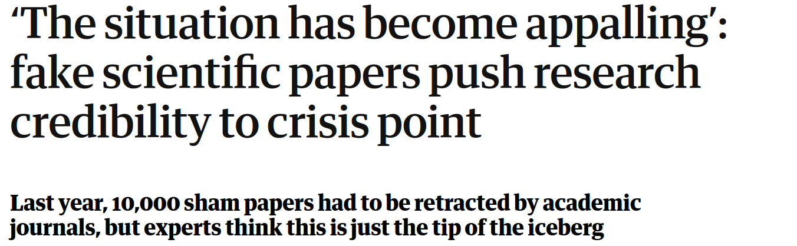
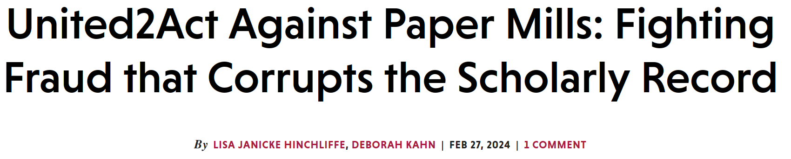
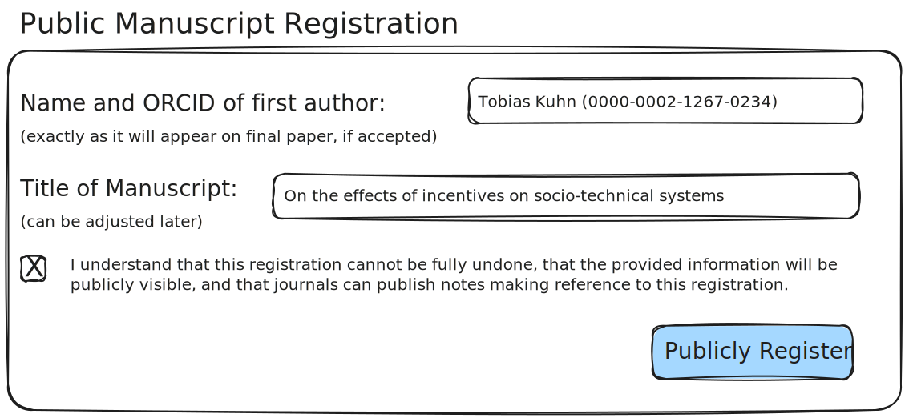
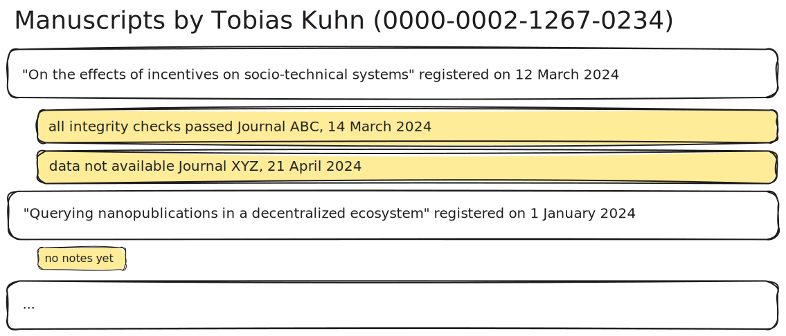

## Public Manuscript Registration

_A proposal for helping journals tackling the research integrity crisis._

&nbsp;

<!--by [Knowledge Pixels](https://knowledgepixels.com/)-->

<!--<small>These slides: [https://knowledgepixels.com/slides/mare/](https://knowledgepixels.com/slides/mare/)</small>-->

---

## _Research Integrity Crisis_

---

## Idea:

### _Can we tackle the problem BEFORE submission?_

&nbsp;

Something like a _"research integrity CAPTCHA"_  or a _"journal entry visa"_?

---

## Underlying Problem

_Failed attempts of gaming the system leave no public trace._
<small>(if they fail at the reviewing stage, which is where they should fail)</small>

&nbsp;

Therefore, "keep trying until something goes through" is a tempting strategy for researchers...

---

## Proposed Solution:

### _Public Manuscript Registration_

- Mandatory public registration before submission to journal
- Minimal info: first author name/ORCID + title of manuscript
- Journals may later add public notes, positive or negative

---

## _Registering:_

---

## _Checking:_

---

## Goals

- Requirement for exposure of manuscript/author to negative flagging _keeps away bad actors from the start_

- _Possibility_ of flagging is sufficient (mostly): journals don't actually need to publish notes about manuscript

---

## Integration:

### _Minimal/Manual_

- _Note on journal submission page:_ "Important: Register your manuscript here [link] before submission"
- Editors-in-chief check whether _new submissions are found on registration site_; if not send desk-rejects
- Editors-in-chief make sure for camera-ready papers that _first author name/ORCID matches registration_

&nbsp;

or tighter/smoother integration via _**APIs**_

---

## Will this work?

_We don't know..._

---

## Possible First Steps

- Develop a _prototype_ with all core features
- Use the prototype to show it to _key actors_ (people at Sage, editors-in-chief, editors, authors), and get feedback
- Run a _small test_ at a selected Sage journal (e.g. testing it as optional step, or mandatory step for 1 week, etc.)
- _Evaluate_ and decide on whether to continue and expand
- Evaluation also includes _legal_ aspects

---

## That's it!

We'd love to hear your thoughts on this proposal.

(extra slides follow)

---

## Gaming Made Hard...

_Ensuring ORCID belongs to first author:_

- First author needs to register via ORCID to do registration
- Submission system requires first author to verify via ORCID (or more advanced: check via secret co-authorship code shown after registration)

_Incentives against use of throw-away ORCID identifiers:_

- Final accepted paper will have same ORCID and name!
- Many manuscripts registered under same name but different ORCIDs will look suspicious
- Varying your name/ORCID is bad for visibility/reputation

---

## Extra Fields

_Further possible (optional) registration fields:_

- ROR of organization
- Preprint URLs
- Checkbox for compliance with integrity guidelines
- ...

