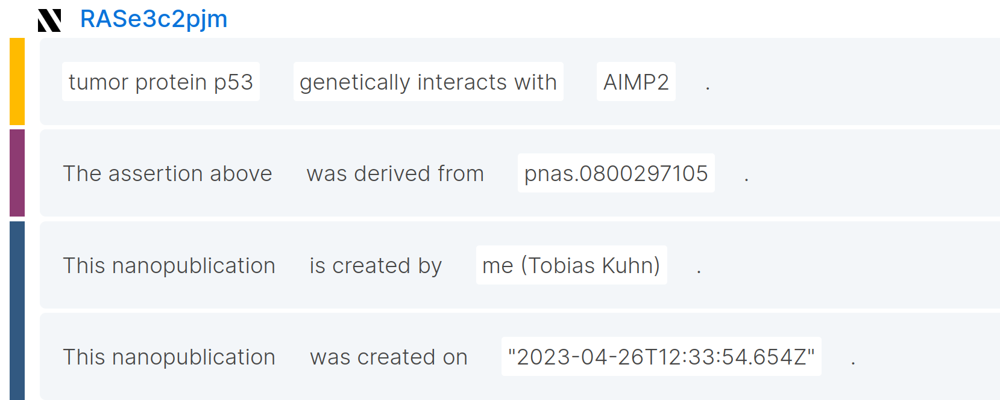
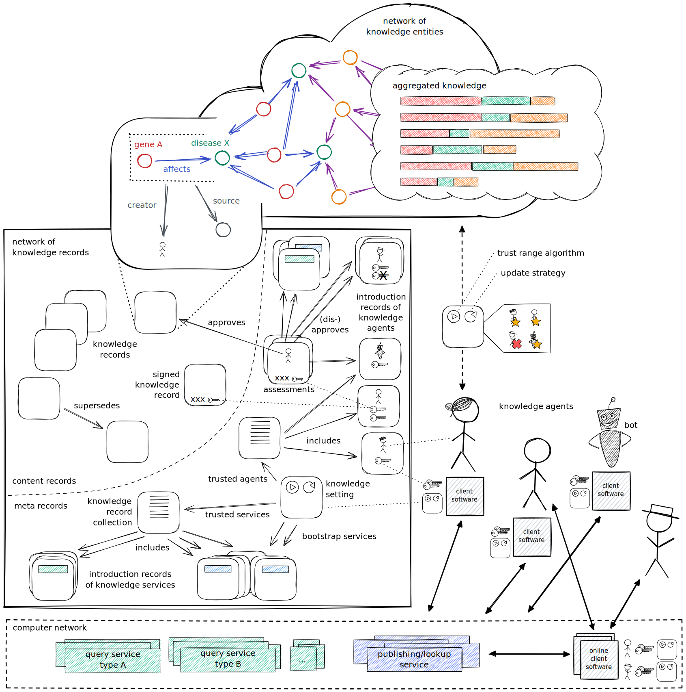
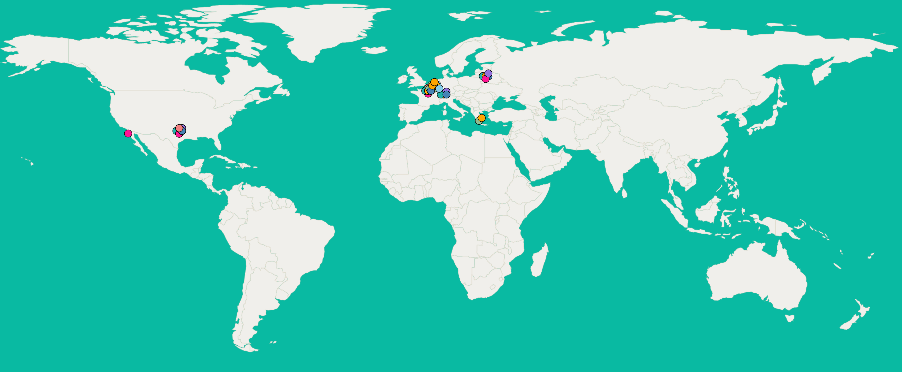
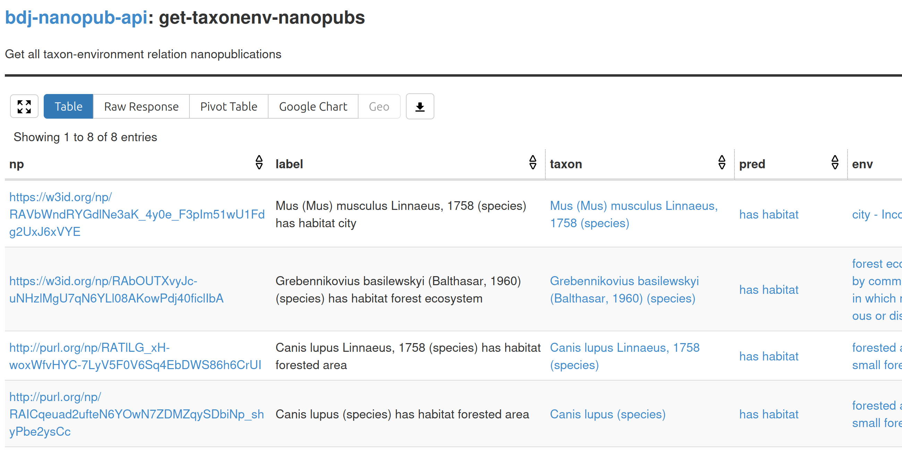
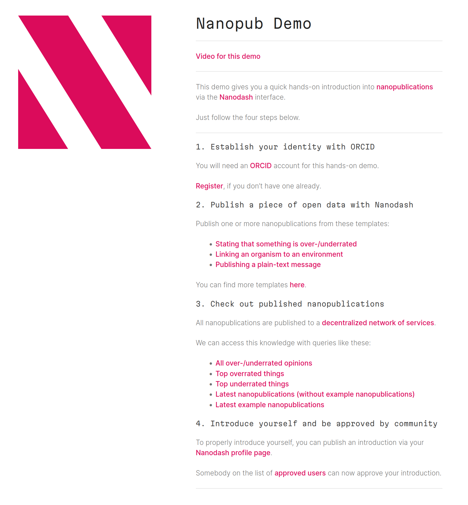

## _Nanopublications:_ rethinking global knowledge sharing

  

Tobias Kuhn, [Knowledge Pixels](https://knowledgepixels.com/)

**Metagov Seminar - 20 March 2024**

<small>These slides: [https://knowledgepixels.com/slides/metagov-nanopubs/](https://knowledgepixels.com/slides/metagov-nanopubs/)</small>

---

## Current Knowledge Sharing is very Inefficient

- Scholarly knowledge mostly published as _narratives_ in papers (not as database entries)
- _No reliable automatic processing_ for aggregation, question answering, etc.
- Contributions to scholarly discourse in social media or blogs are _disconnected and not rewarded_
- ...

---

## <svg xmlns="http://www.w3.org/2000/svg" viewBox="0 0 8 8" height="1ex"><path d="M5,8H8L3,0H0M8,4.8V0H5M0,3.2V8H3"/></svg>  What are Nanopublications?

- _Tiny packages of knowledge graph contributions_
- with provenance and metadata
- encoded in machine-interpretable language (RDF)

<small>[https://nanopub.net/](https://nanopub.net/)</small>

---

## <svg xmlns="http://www.w3.org/2000/svg" viewBox="0 0 8 8" height="1ex"><path d="M5,8H8L3,0H0M8,4.8V0H5M0,3.2V8H3"/></svg> Nanopublications

- _Can be about anything:_
  - e.g. domain-level links between genes/diseases/organisms/drugs/etc., data entries, metadata, reviews, comments, opinions, workflows, etc.
- Reliable hash-based identifiers and digital signatures
- Linked to their creators (e.g. via [ORCID](https://orcid.org/))
- Vocabulary terms can be defined on the fly if needed

---

## Vision: _Knowledge Space_

ecosystem for sharing knowledge much more efficiently

<small>[https://w3id.org/knowledge-space/](https://w3id.org/knowledge-space/)</small>

---

## The Knowledge Space is ...

- like a _knowledge graph_ but open, decentralized, and collaborative
- like the _Semantic Web_ but robust, scalable, and trust-aware
- like a _blockchain_ but without a chain and with assertions instead of transactions
- like a _container environment_ (Docker) but for knowledge instead of software
- (**not** like a _Large Language Model_)

---

## Knowledge Space Principles

- Everything is communicated in _formal logic_, in a manner that humans can understand and computers can interpret, using a universal and extensible vocabulary
- Statements are expressed in small _knowledge records_, making each record individually reusable and referenceable
- ...

[ **nanopublications:** implementation of _knowledge records_ ]

---

## Knowledge Space Properties

- _open and inclusive:_ everybody can publish / add servers
- _detailed provenance:_ source, authorship, workflows, etc.
- _publish first - worry about quality later:_ decide whether "good enough" at time of use (not time of publication)
- _bottom up - no central authority:_ who is trusted is community-defined; multiple webs of trust

---

## Nanopublication Ecosystem of Services

- Decentralized and open network of servers
- _Publishing layer:_ publish & retrieve knowledge (ID lookup)
- _Querying layer:_ access knowledge (complex queries)

<small>[https://monitor.knowledgepixels.com/](https://monitor.knowledgepixels.com/)</small>

---

## Querying Example

_Query to network:_

    ?np np:hasAssertion ?assertion .
    graph ?assertion {
      ?assoc a
        biolink:OrganismTaxonToEnvironmentAssociation .
      ?assoc biolink:subject ?taxon .
      ?taxon biodiv:hasTaxonName ?taxonname .
      ?assoc biolink:predicate ?pred .
      ?association biolink:object ?env .
    }

<small>get all taxon-environment relations (simplified example)</small>

_Result from network:_

---

- Web interface to _browse and search_ nanopublications
- and _publish_ nanopublications via template-based forms
- Connects to network of services (no local DB)

<small>[https://nanodash.knowledgepixels.com/](https://nanodash.knowledgepixels.com/)</small>

---

## Demo

Visit [https://knowledgepixels.com/nanopub-demo/](https://knowledgepixels.com/nanopub-demo/)

---

## Thank you for your attention!

