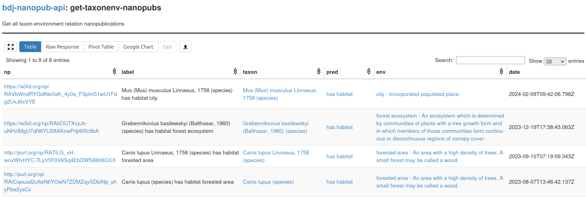

<svg xmlns="http://www.w3.org/2000/svg" viewBox="0 0 8 8" width="160px">
<path d="M5,8H8L3,0H0M8,4.8V0H5M0,3.2V8H3"/>
</svg>

  

## Nanopublication Ecosystem

an introduction to nanopublications and their ecosystem

<small>These slides: [https://knowledgepixels.com/slides/nanopub-ecosystem/](https://knowledgepixels.com/slides/nanopub-ecosystem/)</small>

---

## <svg xmlns="http://www.w3.org/2000/svg" viewBox="0 0 8 8" height="1ex"><path d="M5,8H8L3,0H0M8,4.8V0H5M0,3.2V8H3"/></svg>  What are Nanopublications?

- _Tiny packages of knowledge graph contributions_
- with provenance and metadata
- encoded in machine-interpretable language (RDF)

<small>[https://nanopub.net/](https://nanopub.net/)</small>

---

## <svg xmlns="http://www.w3.org/2000/svg" viewBox="0 0 8 8" height="1ex"><path d="M5,8H8L3,0H0M8,4.8V0H5M0,3.2V8H3"/></svg> Nanopublications

- Can be reliably retrieved via hash-based identifiers and can be digitally signed
- Are linked to their creators (e.g. via [ORCID](https://orcid.org/))
- _Can be about anything:_
  - e.g. domain-level links between genes/diseases/organisms/drugs/etc., data entries, metadata, reviews, comments, opinions, workflows, etc.
- Vocabulary terms can be defined on the fly if needed

---

## Ecosystem of Services

- _Decentralized and open network of servers_
- Publishing layer: publish, retrieve, archive knowledge (ID-based lookup)
- Querying layer: access knowledge (complex queries via SPARQL etc.)

---

## Example Query

Get all taxon-environment relations:

---

- Web interface to _browse and search_ nanopublications
- and _publish_ nanopublications via template-based forms
- Connects to network of services (no local DB)

**Try it out yourself:**

[https://nanodash.knowledgepixels.com/](https://nanodash.knowledgepixels.com/)

---

## Thank you for your attention!

