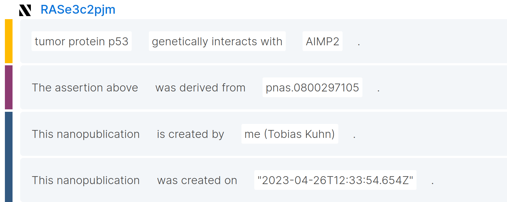
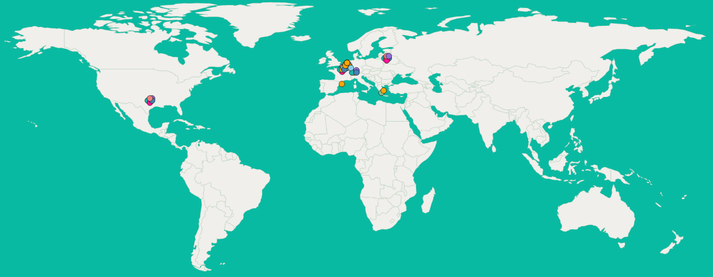

## Nanopublication Ecosystem

<svg xmlns="http://www.w3.org/2000/svg" viewBox="0 0 8 8" width="120px">
<path d="M5,8H8L3,0H0M8,4.8V0H5M0,3.2V8H3"/>
</svg>

An introduction the nanopublications and their ecosystem.

<small>These slides: [https://knowledgepixels.com/slides/nanopub-ecosystem/](https://knowledgepixels.com/slides/nanopub-ecosystem/)</small>

---

<svg xmlns="http://www.w3.org/2000/svg" viewBox="0 0 8 8" width="80px">
<path d="M5,8H8L3,0H0M8,4.8V0H5M0,3.2V8H3"/>
</svg>

## <svg xmlns="http://www.w3.org/2000/svg" viewBox="0 0 8 8" height="1em"><path d="M5,8H8L3,0H0M8,4.8V0H5M0,3.2V8H3"/></svg>  What are Nanopublications?

- _Tiny packages of knowledge graph contributions_
- Encoded in machine-interpretable language (RDF)
- Come with provenance and metadata (also in RDF)
- Treated as individual independent publications

---

## Nanopublication Ecosystem

<small>[https://monitor.knowledgepixels.com/](https://monitor.knowledgepixels.com/)</small>

- _Decentralized and open network of servers_
- Layers of publishing services / querying services
- Has been up continuously for more than 10 years

---

- _Nanopublication client_
- Allows for browsing and searching nanopublications
- Allows for publishing nanopublication via template-based forms (which are defined as nanopublications too)
- Doesn't have any local database, but _gets all its data from the network_

**Try it out yourself:**

[https://nanodash.knowledgepixels.com/](https://nanodash.knowledgepixels.com/)

---

## Thank you for your attention!

