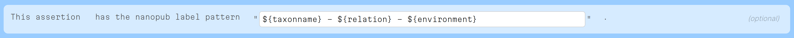
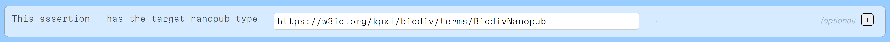

## Types and Labels for Nanopublications

_Tobias Kuhn_

Nano Session #8, 12 December 2023

---

## Problems

- How to quickly _display_ a nanopublication (when we don't know what it is about)
- How to define subsets of nanopublications to _filter_ them (e.g. to load them into a triple store)

---

## Solution

- A set of _best practices_ on how to assign labels and types
- Label/types can be _determined locally_ (by just processing the given nanopublication)

---

## Labels

_Label is determined as follows (with decreasing priority):_

- Pubinfo with `np rdfs:label "LABEL"`
- Pubinfo with `np dct:title/dce:title "LABEL"`
- Prov/pubinfo with `assertion rdfs:label "LABEL"`
- Prov/pubinfo with `assertion dct:title/dce:title "LABEL"`
- Assertion with `thing rdfs:label "LABEL"` and pubinfo with `np npx:introduces/npx:describes thing`

A nanopublication has just _one label_.

---

## Labels in Use

Labels in use: [https://tapas.knowledgepixels.com/tapas.html?api=knowledgepixels/nanopub-query-api&op=/get-latest-nanopubs](https://tapas.knowledgepixels.com/tapas.html?api=knowledgepixels/nanopub-query-api&op=/get-latest-nanopubs)

(sneak preview using the new Nanopub Query services)

---

## Labels and Templates

Assertions can specify a label pattern ([link to example](http://purl.org/np/RAJwu5sVubRqXY4t2gkSoGxWkMyZqnpkGTCPiTlmvi4so)):

This then automatically generates the appropriate label ([link to example](http://purl.org/np/RATlLG_xH-woxWfvHYC-7LyV5F0V6Sq4EbDWS86h6CrUI)):

`this: rdfs:label "Canis lupus Linnaeus, 1758 (species) - has habitat - forested area"`

---

## Types

_Types are determined as follows:_

- Pubinfo with `np rdf:type/npx:hasNanopubType TYPE`
- Assertion/Prov with `assertion rdf:type TYPE`
- Assertion with `thing rdf:type TYPE` and pubinfo with `np npx:introduces/npx:describes thing`
- If all assertion triples share predicate: `TYPE=predicate`
- If all assertion triples share subject: `TYPE=subject`
- If assertion contains `npx:declaredBy`: `TYPE=npx:declaredBy` (special case)

A nanopublication can have _several types_.

---

## Types versus Classes

`rdf:type`

- Links an instance to its class (like an element to a set it is a member of)

`npx:hasNanopubType`

- Links a nanopublication to an identifier that denotes its "type" (which can be a class or a predicate or generally any IRI)

---

## Types in Use

We can load nanopublications into different triple stores based on their type: [https://query.np.trustyuri.net/](https://query.np.trustyuri.net/)

(Another sneak preview of the new Nanopub Query services)

---

## Types and Templates

Assertions can specify a target type ([link to example](http://purl.org/np/RAJwu5sVubRqXY4t2gkSoGxWkMyZqnpkGTCPiTlmvi4so)):

This then automatically assigns the type ([link to example](http://purl.org/np/RATlLG_xH-woxWfvHYC-7LyV5F0V6Sq4EbDWS86h6CrUI)):

`this: npx:hasNanopubType <https://w3id.org/kpxl/biodiv/terms/BiodivNanopub>`

---

## Thank you for your attention!

