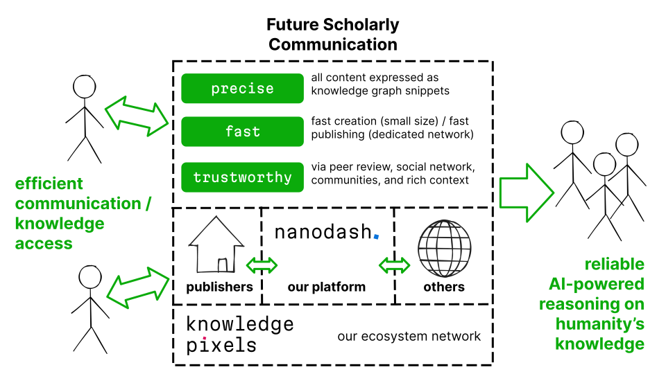

[`knowledgepixels.com`](https://knowledgepixels.com)

## Pitch Deck

<small>under construction...</small>

---

---

---

### Our Technology: Nanopublications

 

- Based on small, context-aware data snippets
- Universal: for all kinds of scholarly knowledge
- Published via decentralized ecosystem

---

---

## Market Validation

Global spending on scholarly communication/technology:

- _$1 billion/year_ APCs (Article Processing Charges)
  - &gt; 502k Open Access articles/year
  - avg. $1626/article
- _$6 billion/year_ on journal subscriptions
  - &gt; 2 million articles/year
- _$50 billion/year_ on technology by universities

---

## Business Model
### Multi-Sided Platform

- **Researchers / Communities / Projects / Institutions:**
  - _Freemium model_
  - Free in the short term
- **Publishers / Journals:**
  - _Subscription model_
  - Medium term

---

## Plans and Pricing

- **Nanodash for researchers (with group/institution discounts):**
  - Free
  - Standard: $200/y/user
  - Pro: $400/y/user
  - _(~ same as Overleaf pricing)_
- **Nanodash for journals (with discounts for large ones):**
  - Standard: $12/y/article _(<1% of avg. APC)_
  - Pro: $18/y/article

---

## Roadmap Phases 1 & 2

_Phase 1 "prove value" (2023)_

- Nanodash Beta launch **[done]**
- Attract ~5 small communities
- Win projects/consortia partners / innovation grants

_Phase 2 "get market-ready" (2023/24)_

- Make Nanodash user-friendly and market-ready
- Complete pre-seed investment round

---

## Roadmap Phases 3 & 4
_Phase 3 "win communities" (2024/25)_

- Gain large communities (> 100 users)
- Launch freemium plans
- First subscriptions by publishers

_Phase 4 "expand" (2025+)_

- Push expansion with marketing
- Scale up ecosystem
- Grow revenues

---

## Potential Outcomes

- _**Best-case scenario:**_ Our ecosystem revolutionizes scientific communication and we dominate this new market, with upwards of $100M of yearly revenue
- _**Realistic success scenario:**_ Our ecosystem is established in major scientific domains and we occupy a large share of the created market, with around $10M of yearly revenue
- **Worst-case scenario:** We keep providing semantic publishing services and expertise to innovative publishers like IOS Press and Pensoft

---

## Competition Analysis

<small>
<table align="center">
<tr>
  <th></th>
  <th>ResearchGate, Academia.edu</th>
  <th>LinkedIn, Twitter, Mastodon</th>
  <th>Wikidata</th>
  <th>StackOverflow, Discourse, etc.</th>
  <th>Journal systems</th>
  <th>Nanodash</th>
</tr>
<tr>
  <th>structured knowledge</th>
  <td></td>
  <td></td>
  <td><em class="check"><strong>✓</strong></em></td>
  <td></td>
  <td></td>
  <td><em class="check"><strong>✓</strong></em></td>
</tr>
<tr>
  <th>fast publishing</th>
  <td><em class="check"><strong>✓</strong></em></td>
  <td><em class="check"><strong>✓</strong></em></td>
  <td><em class="check"><strong>✓</strong></em></td>
  <td><em class="check"><strong>✓</strong></em></td>
  <td></td>
  <td><em class="check"><strong>✓</strong></em></td>
</tr>
<tr>
  <th>social network</th>
  <td><em class="check"><strong>✓</strong></em></td>
  <td><em class="check"><strong>✓</strong></em></td>
  <td></td>
  <td></td>
  <td></td>
  <td><em class="check"><strong>✓</strong></em></td>
</tr>
<tr>
  <th>trusted communities</th>
  <td></td>
  <td></td>
  <td></td>
  <td><em class="check"><strong>✓</strong></em></td>
  <td></td>
  <td><em class="check"><strong>✓</strong></em></td>
</tr>
<tr>
  <th>peer review aware</th>
  <td><em class="check"><strong>~</strong></em></td>
  <td></td>
  <td></td>
  <td></td>
  <td><em class="check"><strong>✓</strong></em></td>
  <td><em class="check"><strong>✓</strong></em></td>
</tr>
</table>
</small>

---

## The team

#### Philipp von Essen</h4>

**marketing / business administration**

- MA in Business and Economics
- 5 years of experience in successful startup launch (republik.ch)
- track record as team leader and head of finance

#### Tobias Kuhn

**software development / research**

- PhD in Computer Science
- co-author of FAIR principles
- Nanodash developer and nanopublication technology leader
- 12 years of research experience

---

## Financial Projections

...

---

## Fundraising

...

---

## End of Pitch

(extra slides follow)

---

## Problem

- **Publishing of scientific knowledge and discourse is:**
  - _unstructured_ (narratives instead of knowledge graphs)
  - _disconnected_ (platforms only know about own content)  <!-- all major communication platforms used by researchers are data silos:  ResearchGate, Academia.edu, LinkedIn, Twitter -->
  - _slow_ (9-18 months from submission to formal publication)  <!-- source: https://doi.org/10.1016/j.joi.2013.09.001 -->
  	or _untrusted/unrewarded_ (blogs/social)
- **Consequences:**
  - _Researchers_ waste time and energy
  - _Society_ wastes money
  - _Everybody_ lacks scientific insights
<!--
- Existing approaches for organizing scientific knowledge (ResearchGate, ChatGPT, etc.)  are shallow and imprecise
- _Science is slowed down by this lack of efficient communication_
-->

---

## Solution:

### precise, fast, and trustworthy knowledge updates

- _Precision:_ Machine-interpretable due to logic-based representation
- _Speed:_ Created quickly due to minimal size, and disseminated quickly due to dedicated ecosystem
- _Trust:_ Trust through social network and through rich statement-level context

---

## Value Proposition

- **Researchers / Communities / Projects / Institutions:**
  - Communication with precision, speed, and trust
  - Visibility and recognition in communities
  <!-- - Credit for community-driven datasets -->
  <!--  - → time saved for staying up-to-date, AI-powered assistance, etc. -->
- **Publishers / Journals:**
  - Strong connection to research communities
  - Getting good papers/reviewers, visibility, reputation
  <!-- - Role as guardians of scientific communities and data -->
  <!-- - New economic opportunities in ecosystem -->
- **Everybody:**
  - Precise and trustworthy AI-powered reasoning on humanity's knowledge

---

## Ecosystem

We are building a new nanopublication-based ecosystem for knowledge sharing:

- _Decentralized:_ based on a global network of services
- _Open and anti-silo:_ everybody can join, and all data is open and accessed as a single global knowledge graph
- _Reliable:_ services are redundant and content is cryptographically verified

---

## Short-Term Business Model

- **Partners:**
  - Funds from research projects and innovation grants
  - _Value:_ Help research communities prepare their future communication technology
- **Researchers / Communities / Projects / Institutions:**
  - Free use of Nanodash
  - _Value:_ Fast, precise, and trustworthy knowledge updates; visibility and recognition in community

---

### Calculations for Open Access

- 501 950 articles with APC published in 2019 (with article-level data in DOAJ) with avg. $1626/article [[source]](http://hdl.handle.net/10393/42327)
- Therefore $816 170 700 total APCs in 2019 (not counting articles not in DOAJ and hybrid journals)
- Conservative estimate: $1B/y total APCs of OA/hybrid journals combined

---

### Calculations for Journal Subscriptions 1/2

- Overall 2.9M articles/year in 2020 [[source]](https://ncses.nsf.gov/pubs/nsb20214/publication-output-by-country-region-or-economy-and-scientific-field)
- Minus 500k+ OA articles gives >2M in subscription model

---

### Calculations for Journal Subscriptions 2/2

- No global data; New Zealand universities spend for biggest 4 publishers "around US$14.9 million in 2016 (the total spending on all publishers is likely at least 2-3 times that)" [[source]](https://theconversation.com/universities-spend-millions-on-accessing-results-of-publicly-funded-research-88392)
- Conservative estimate: NZ universities spend $30M/y on subscriptions contributing 0.5% of global share (NZ has 0.25% of global GDP)
- Therefore globally 6B/y spent on journal subscriptions

---

### Calculations for University Technology Spending

- $16B per year in US [[source]](https://www.linkedin.com/pulse/universities-spend-16bn-each-year-technology-hardly-any-barosevcic/)
- US share of global R&D is 28% [[source]](https://ncses.nsf.gov/pubs/nsb20225)
- Assuming university tech expenses are proportional to R&D: global university tech expenses = $57B/year

---

### Calculations for Number of Researchers/Groups/Journals

**Researchers:**
- ~1 "article equivalent" per researcher and year [[source]](https://www.sciencedirect.com/science/article/pii/S1751157715000218)
- 3M articles/y therefore means 3M active researchers

**Research groups:**
- group size is on average 7.3 [[source]](https://www.ncbi.nlm.nih.gov/pmc/articles/PMC4465944/)
- Therefore ~400k research groups globally

**Journals:**
- ~30k globally; 28060 from largest 100 publishers [[source]](https://www.emerald.com/insight/content/doi/10.1108/JD-04-2022-0083/full/html)

---

### Calculations for Realistic Success Scenario

**20% of 3M researchers (600k) use Nanodash**
- 18k paying users (3% conversion rate), paying on avg. $200/y (pro plan income is offset by discounts)
- _→ 3.6M/y revenue from researchers_

**20% of 3M articles/y (600k) in journals with Nanodash plan**
- $12/article (pro plan income is offset by discounts)
- _→ 7.2M/y revenue from journals_

